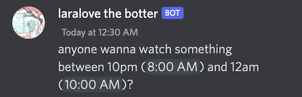

# timezoner

  

goodbye to timezone conversions! just type some time in chat and everyone magically sees it in their own timezone

and someone 10 hours ahead sees:

## features

- does all the conversion automatically in chat, no commands or dms or annoying stuff like that
- the ones reading the times don't need to do anything
- supports all the sane formats: `1pm` `1:30 Pm`  `13:30`...
- has a `/copy` command that you can use to share times in dms etc
- setting up your timezone couldn't be easier with timezones being suggested right inside discord, literally just type `/timezone new york`

## contact

- i am the only person responsible for the bot, it has no team
- discord server: https://discord.gg/6vAzfFj8xG
- discord username: laralove#7186
- email: laralove143@icloud.com
- github issues

## terms of service
- *"i" refers to laralove143, the developer of timezoner*
- *"you" refers to all users of the bot*
### privacy
- your currently selected timezone is encrypted then saved, and only used to convert times to timestamps
- no other data, including message content is saved anywhere
### disclaimers
- the webhooks the bot executes copy your message content, nickname and avatar, i am not responsible for this copied data
- i am the sole owner and developer of this bot
- the hosted application is built directly from this repo
### self-hosting
these clauses override all other licenses:
- *"you" refers to the self-hoster of the bot*
- you may not advertise the self-hosted bot, such as on websites such as top.gg
- the self-hosted bot may not be in over 5 guilds
- you must direct the feedback/support requests to me

## nerdy stuff

made with [rust](https://www.rust-lang.org) and [twilight](https://github.com/twilight-rs/twilight) and sqlite
