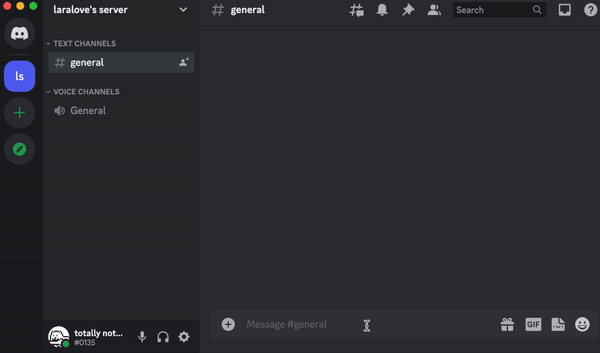
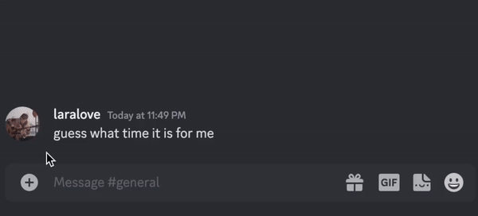

[SUPPORT_SERVER_INVITE]: https://discord.gg/KUMdnjcE97

# timezoner

- [add to your server](https://discord.com/api/oauth2/authorize?client_id=909820903574106203&permissions=536947776&scope=bot%20applications.commands)
- [get support][SUPPORT_SERVER_INVITE]

goodbye to timezone conversions! a discord bot that converts times so that everyone sees it in their own timezone

## features

### convert a time in a message

when there's a time in a message, the bot will add a reaction to it, just hit that reaction and everyone magically sees the time in their own timezone!

- only the person that sent the message needs to set their timezone, the ones reading the time don't even need to do anything
- supports basically all the time formats

and someone 8 hours behind sees:

### share a date

wanna include a date? the `/date` command is in your command

- you can style it too, showing just the date for example

### share a date in dms

you can even share a date in dms or other servers, just use the `/copy` command

- consider asking the mods to add the bot to the other server though :)

### learn what time it is for someone

wanna know if your friend is asleep for example? now you can in just a second

## getting started

all you have to do is use the `/timezone` command to set your timezone, it takes just a few seconds

- only the people that are sharing times need to do this, people seeing the times don't need to do anything!

## let's get in touch

have a feature idea? noticed a bug? need help with something? or just wanna meet me?

[join the support server][SUPPORT_SERVER_INVITE]

## check out my other bots

- [interchannel message mover](https://github.com/laralove143/interchannel-message-mover): a discord bot to move messages between channels

## sponsors

- [jason](https://github.com/zudsniper): thank you for funding the hosting!
- wanna see your name here? [support me with whatever amount you wish :)](https://github.com/sponsors/laralove143)

## terms of service

- *"i" refers to lara kayaalp, the developer of timezoner*
- *"you" refers to all users of the bot*

### privacy

- your timezone is only used to convert times to timestamps
- only your currently selected timezone is saved, no history is kept
- no other data, including message content, is saved anywhere

### disclaimers

- the webhooks the bot executes copy your message's content, nickname and avatar
- i am not responsible for this copied data
- i am the sole owner and developer of this bot
- the hosted application is built directly from this repo

### self-hosting

these clauses override all other licenses:

- *"you" refers to the self-hoster of the bot*
- you may not advertise the self-hosted bot, such as in app directory or on websites such as top.gg
- the self-hosted bot may not be in over 5 guilds
- you must direct the feedback/support requests to me
